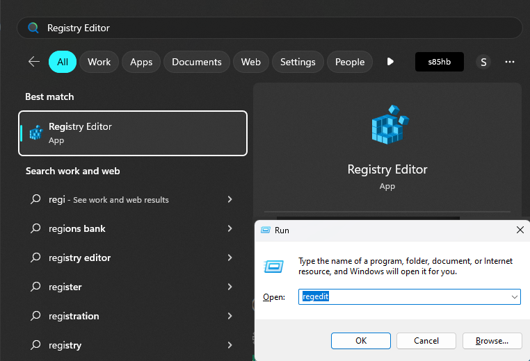
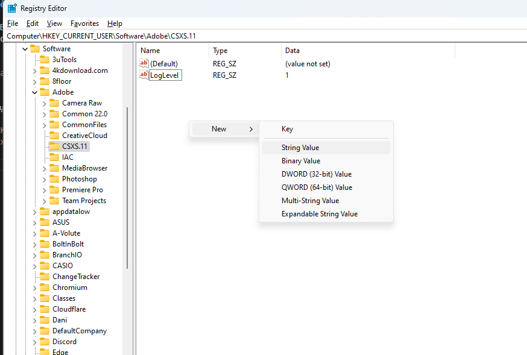
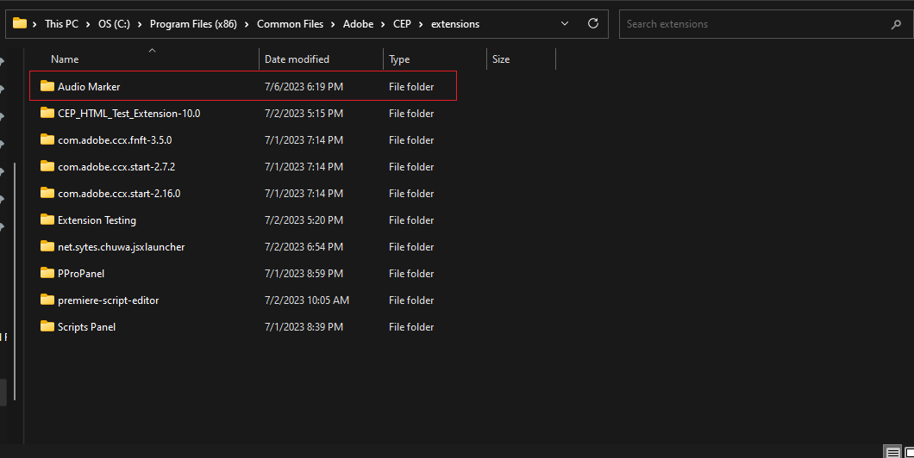
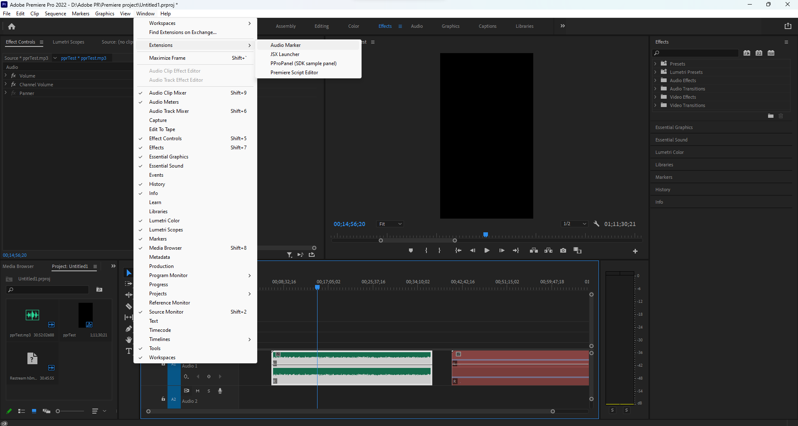

# Audio-Marker

*Tạo marker tự động trên Adobe Premiere Pro*

## Hướng dẫn sử dụng

### 1. Cho phép ứng dụng bên thứ 3

Mở "Registry Editor" bằng cách tìm kiếm bằng window hoặc mở hộp thoại Run (Window + R) và gõ "regedit"



Tìm đến thư mục "CSXS.xx" (xx = 8-11):

```Computer\HKEY_CURRENT_USER\Software\Adobe\CSXS.xx```

Chuột phải > New > String Value. Đặt tên là PlayerDebugMode



Chọn vào PlayerDebugMode, đặt giá trị bằng 1


### 2. Tải về và lưu 

Tải về tool  

[Bản rút gọn (9MB)](https://drive.google.com/drive/folders/1Z9D0E0XbXGUTlEeg5FLqqPzYKueKBi4z?usp=sharing) (nếu đầu vào của bạn mặc định là wav)

[Bản đầy đủ (255MB)](https://drive.google.com/drive/folders/1fgsPb8lZN53GqQoqENIKCBIgfWvrQrDe?usp=sharing) (nếu đầu vào của bạn có thể là mp3, mov, mp4, ...)


và lưu vào

``` C:\Program Files (x86)\Common Files\Adobe\CEP\extensions\```




### 3. Sử dụng trên Adobe Premiere Pro

Tại Project, chọn Window > Extensions > Audio Marker



Chỉnh sửa các thông số, chọn âm thanh trên timeline cần tạo markers và ấn "Tạo markers". Markers sẽ được tự động tạo và thông báo khi hoàn thành.


### 4. Lưu ý: 
- File âm thanh (mov, mp3, wav, ...) được import không được có ký tự đặc biệt (nên để VietLienKhongDau).
- Sau khi tool được chạy, sẽ có một file rác đuôi ".wav" (nếu đầu vào không phải là wav) trong cùng thư mục của file audio. Bạn có thể xóa nó đi hoặc giữ lại nếu bạn muốn sử dụng lại.
- Khi chèn âm thanh vào timeline cần giữ nguyên độ dài vì markers được tạo dựa trên file âm thanh gốc

### Update
- Tính năng chèn, xóa preset cho object
- Tính năng lưu, thêm, sửa, xóa preset